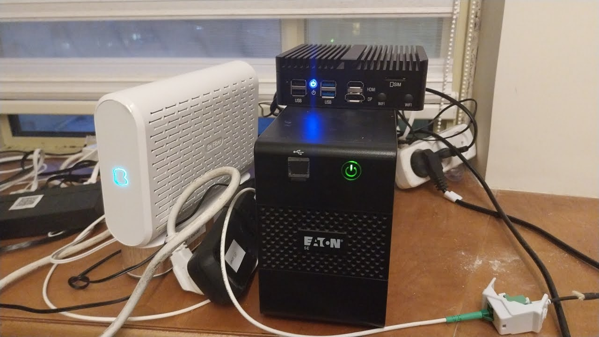
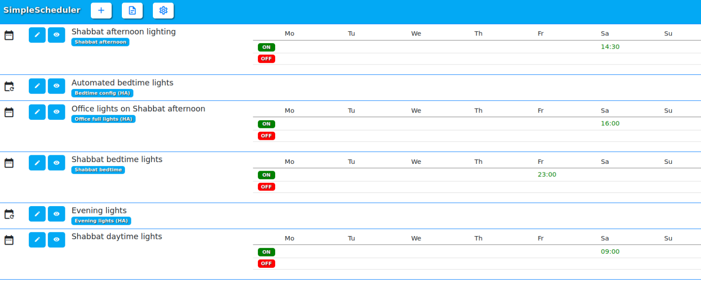
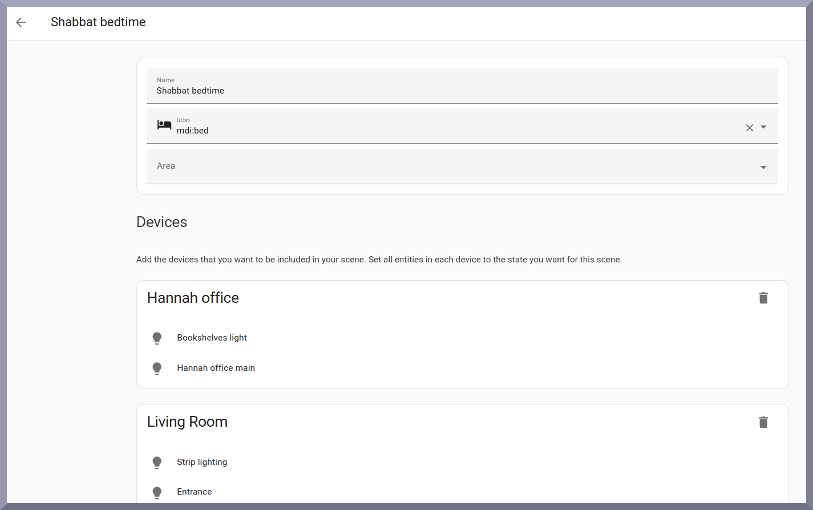
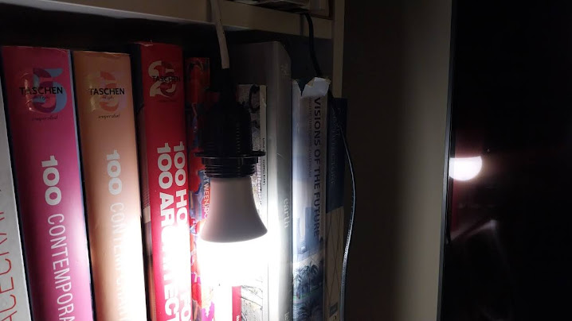
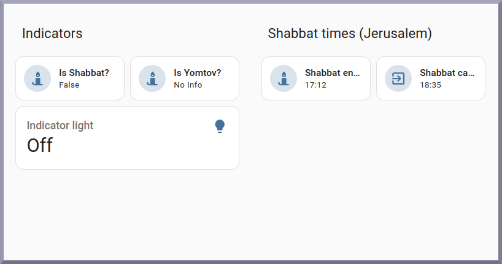

# Home Assistant Shabbat & Yom Tom

*(As I work on automations and scripts they will be added into the subfolders. This blog just explains the overall purpose of the project!)*

*By: Daniel Rosehill*

Shabbat is a weekly religious ritual practised by observant Jews around the world. It stretches from before sundown on Friday through to the start of nightfall on Saturday (approximately; customs vary slightly by location).

During Shabbat, religiously observant Jews refrain from using electricity. However … hosting guests and … well .. eating … are popular activities in the Shabbat-observant world. Shabbat is intended to be a day of rest, after all. Sitting in darkness and eating cans of tuna wouldn’t really be in the Shabbat spirit.

The traditional solution to this religious quandary has been a decidedly low-tech one.

Enter stage the humble manual electricity timer as shown on the left. If you ever wondered why your religious Jewish neighbors had enough of these to start a small electricity store, now you have your answer.

Fortunately, technology has evolved. Personally, I think the idea of using modern technology to assist in the observance of a millennia-old ritual is kind of amazing. Enter stage a much more elegant, modular, and granular solution to the Shabbat electricity issue: home automation.

## Prerequisites For This Project

You can use proprietary technologies and their ecosystems for setting up basic home automations. 

But doing so hamstrings your abilities to truly customise and own your system before the get-go.




*My Home Assistant mini PC. Yes, I need a networking cabinet, router, and UPS. No, the weird white powder isn’t cocaine…*

If the sensors and smart lights and smart plugs are the players in this picture, then Home Assistant is the conductor. Home Assistant can tie together components from many different manufacturers and make them all achieve a common purpose..

But enough with the sales pitch. Let’s get down to tech details.

- You’re going to want to run **Home Assistant Operating System (HAOS)** on … something. My wife likes to remind me that I never shy away from making things incredibly complicated. My HAOS is running as a VM in Proxmox which is on the mini PC (which I picked up on Aliexpress and thus far have only praise for).
- Although you could create your own integration based on the [**HebCal Shabbat times REST API](https://www.hebcal.com/home/197/shabbat-times-rest-api)** there’s no need to reinvent this particular technical wheel. I like the **Jewish-Sabbaths-Holidays integration ([Github link](https://github.com/rt400/Jewish-Sabbaths-Holidays))** because it includes a no-BS (excuse the language) binary sensor for Shabbat and Yom Tov (plus so much more). It either IS Shabbat or it’s NOT. Your automations can follow along accordingly.

The second Home Assistant integration that I use is **[SimpleScheduler](https://github.com/arthurdent75/SimpleScheduler)**. You could use it to configure actions to run in relation to the start of Shabbat (e.g., four hours after Shabbat go into bedtime mode). But personally this approach makes more sense for me.

## Getting The Integration Set Up Correctly

The easiest way to install the integration is through the Home Assistant Community Store (HACS):

.png)

Shabbat times are based on geolocation and your Home Assistant installation needs to know where it is to pull in the correct Shabbat times from the integration. So make sure that you have the following set up in configuration.yaml.

```yaml
` homeassistant:
         latitude: 32.0667
     longitude: 34.7667
     time_zone: Asia/Jerusalem   `
```

If you don’t know your geocordinates, [find them here](https://www.latlong.net/).

Here’s what the plugin authors recommend adding to your configuration.yaml. This will get you the bare essentials (unless you live in Jerusalem, we’ll cover that next):

```yaml
# Example configuration.yaml entry
sensor:
  - platform: hebcal
    resources:
      - shabbat_in
      - shabbat_out
```

If you want to enable “Jerusalem candle-lighting” (40 minutes before sundown) then you’ll want to add:

```yaml
jerusalem_candle: True
```

So, for example:

```yaml
# Example configuration.yaml entry
sensor:
  - platform: hebcal
    jerusalem_candle: True
    resources:
      - shabbat_in
      - shabbat_out
```

YAML’s less-endearing quality is that it is VERY particular about indentation. But the effort will seem worth it when we’re enjoying our Shabbat-ready smart home!

## Creating Scenes And Automations To Manage Everything

Next on our to-do list is creating the scenes and automations that are going to actually control all of our devices over the course of Shabbat.

I’ve divided my automation-ing into several points in time:

- ***Shabbat comes in:\*** get the apartment into Shabbat mode (if you’re lucky enough to live in an actual house – congratulations!)
- ***It’s bedtime:\*** Turn the bedroom lights off. But leave on the couch light for whoever wants to read.
- ***It’s morning**!* Rather than use a forced lights-on automation to coax myself out of bed at a reasonable hour (it’s Shabbat!) I instead just get the living spaces set up. During the summer months, this is probably unnecessary. To take this further, you could tweak this by adding conditions based around a weather forecast to your automation.
- ***It’s Shabbat afternoon:\*** Change the lights a little more.
- ***Shabbat’s out:\*** One quirky feature I decided to add to this was a “Shabbat light.” It’s a bulb that comes on after Shabbat and turns on after it. Its sole purpose is to serve as a physical indicator for when Shabbat is in and out.

Each of these setups is a separate scene.

The first of these (Shabbat comes in) is triggered by the Shabbat times integration (as well as the automation that turns off the indicator bulb when Shabbat is out). The rest are run off Simple Scheduler. Their time can be modified a little throughout the year or as preferences change.

For example:.png)


Here’s the automation that kicks off ‘Shabbat mode’:



In YAML:

```yaml
alias: Start of Shabbat automation
description: "Puts home into Shabbat configuration mode "
trigger:
  - platform: state
    entity_id:
      - sensor.hebcal_is_shabbat
    to: "True"
condition: []
action:
  - service: scene.turn_on
    metadata: {}
    target:
      entity_id: scene.start_of_shabbat
mode: single

```

This is V1.0 of my humble Shabbat indicator light. It’s a simple Zigbee E27 hanging off a socket. 



The next steps of the project are making this look good. I’m thinking of DIY-ing a custom lightbox.


I also built a little monitoring dashboard just to check up on the condition of my sensors before Shabbat:




There are dozens of ideas I’ve already jotted down for how to take this further (next in line: send a notification 30 minutes before candle-lighting). But …. it’s a functional start.


## Dashboard Repository

I'm sharing the dashboards I build and update here:

https://github.com/danielrosehill/Home-Assistant-Shabbat-Yom-Tov-Dashboard/tree/main

Thanks for reading!

*Daniel Rosehill*
