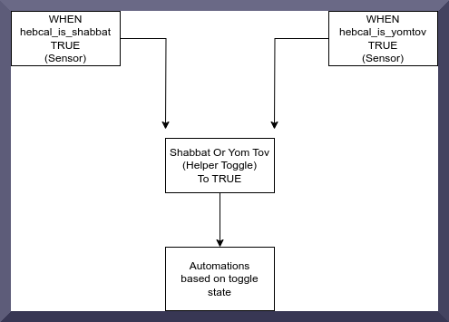
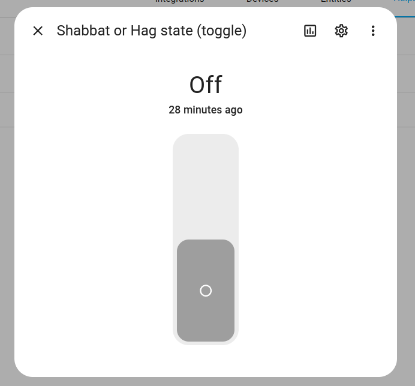

# Shabbat OR Yom Tov Helper (Automations)

Jewish homeowners who want to configure automations in Home Assistant to facilitate religious observance will want to do so in two instances:

- It's Shabbat (a weekly event!)
- It's a Yom Tov (an event that occurs at intervals in the calendar)

The [Jewish Sabbath Holidays Home Assistant add-on](https://github.com/rt400/Jewish-Sabbaths-Holidays) provides two sensors that are very helpful for configuring automations (these in turn are derived from the [HebCal API:](https://www.hebcal.com/home/developer-apis)

```
sensor.hebcal_is_shabbat'
```

This is a simple binary sensor (True/False) for determining whether or not it's Shabbat (based upon your preconfigured candle-lighting time etc).

And:

```
sensor.hebcal_is_yomtov
```

This sensor states "No Info" unless it's a Yom Tov (and changes to the Yom Tov name when one is in effect).

To simplify our automations, let's try to condense both of these sensors into one state that we can (in turn) use to drive our lighting automations  (etc).

I think that this is pretty straightforward, but it sometimes gets confusing thinking about devices, entities, helpers, automations, and so on.

Here's what we're doing:



## Step 1: Create A Toggle (Type Of Helper)

Firstly, we're going to create a toggle called Shabbat Or Hag State (name as you wish)



We could roll all of this into one automation but to make any potential troubleshooting easier I decided to create two separate automations.

## Step 2: Build The Automations That Will Drive The Toggle

The Shabbat one is a bit easier.

When the Shabbat sensor moves to "True" we want to shift the toggle from off to on:

This is what I came up with:

```yaml
alias: Shabbat activates Shabbat/Hag mode
description: "When the Shabbat sensor switches to 'True' we're going to turn the Shabbat or Hag toggle on"
trigger:
  - platform: state
    entity_id:
      - sensor.hebcal_is_shabbat
    to: "True"
condition: []
action:
  - service: input_boolean.turn_on
    metadata: {}
    data: {}
    target:
      entity_id: input_boolean.shabbat_mode
mode: single

```

For the Yom Tov sensor:

The sensor reports 'No Info' unless it's a hag in which case it will report the name of the hag.

The logic we need here is that we want to trigger the toggle if the sensor changes to **any value other** than 'No Info'.

I used this value template (thanks to those who shared it on the Home Assistant forums).

```yaml
alias: Hag triggers state
description: ""
trigger:
  - platform: state
    entity_id:
      - sensor.hebcal_is_yomtov
condition:
  - condition: template
    value_template: "{{ not is_state('sensor.hebcal_is_yomtov', 'No Info') }}"
action:
  - service: input_boolean.turn_on
    metadata: {}
    data: {}
    target:
      entity_id: input_boolean.shabbat_mode
mode: single

```

## Step 3: Then Automate Based On The Toggle

You could trigger an entire cascade of automations that trigger at various times IF it's either Shabbat or Yom Tov:

- IF it's Shabbat or Yom Tov and 23:00, automatically get the apartment into bedtime config.
- IF it's Shabbat or Yom Tov and 09:00, automatically get the apartment into morning config.

Etc.

For instance, here's an automation that triggers a lighting scene for the start of Shabbat/Yom Tov when the helper toggle becomes true:

```yaml
alias: Start of Shabbat / Yom Tov automation
description: >-
  Activates the start of Shabbat / Yom Tov scene when the Shabbat or Yom Tov
  helper becomes true.
trigger:
  - platform: state
    entity_id:
      - input_boolean.shabbat_mode
    to: "True"
condition: []
action:
  - service: scene.turn_on
    metadata: {}
    target:
      entity_id: scene.start_of_shabbat
mode: single

```

